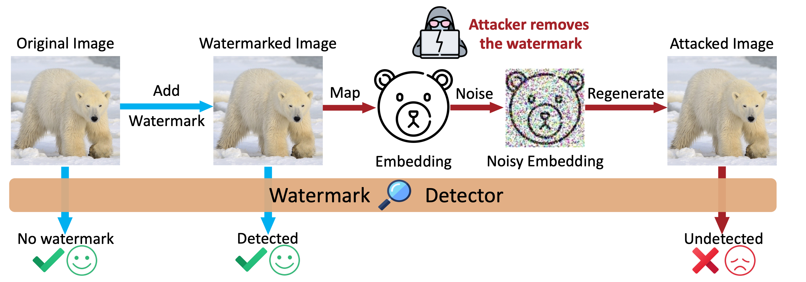

# WatermarkAttacker

### **Welcome to contribute to this project!**

This repository contains the code for the paper [Invisible Image Watermarks Are Provably Removable Using Generative AI](https://arxiv.org/abs/2306.01953).

If you find this repository useful, please cite our paper:

```
@article{zhao2023invisible,
  title={Invisible Image Watermarks Are Provably Removable Using Generative AI},
  author={Zhao, Xuandong and Zhang, Kexun and Su, Zihao and Vasan, Saastha and Grishchenko, Ilya and Kruegel, Christopher and Vigna, Giovanni and Wang, Yu-Xiang and Li, Lei},
  journal={arXiv preprint arXiv:2306.01953},
  year={2023}
}
```

We propose a family of **regeneration attacks** to remove invisible image watermarks. The attack method effectively removes invisible watermarks. 

Our attack first maps the watermarked image to its embedding, which is another representation of the image. Then the embedding is noised to destruct the watermark. After that, a regeneration algorithm reconstructs the image from the noisy embedding. As shown in the figure below:




## Example

First, install the dependencies:

```bash
pip install -r requirements.txt
```

Then, run the following command to install modified [diffusers](https://github.com/huggingface/diffusers)

```bash
pip install -e .
```

Then you can try the demo in `demo.ipynb`.

This demo attacks [invisible-watermark](https://github.com/ShieldMnt/invisible-watermark) which is used in [stable diffusion](https://github.com/Stability-AI/stablediffusion).

## How it works?

In short, our method can be described using the following **equation (1)**

$$
\begin{equation}
\hat{x} =  \underbrace{\mathcal{A}\Big( \overbrace{\phi(x_w) + \mathcal{N}(0,\sigma^2 I_d)}^{\text{destructive}}\Big)}_{\text{constructive}},
\end{equation}
$$

where $x_w$ is the watermarked image, $\phi$ is an embedding function, $\mathcal{N}$ is a Gaussian distribution that adds noise to the embedding, and $\mathcal{A}$ is a reconstruction algorithm that takes the noisy embedding of the image and tries to construct the original image.

The embedding function $\phi$ and the reconstruction algorithm $\mathcal{A}$ can be instantiated with many algorithms.

**Here let's look at how [Stable Diffusion](https://github.com/CompVis/stable-diffusion) can instantiate our algorithm** (see this [blog](https://huggingface.co/blog/stable_diffusion) for more information on Stable Diffusion).


The above figure shows the architecture of Stable Diffusion.

The destructive process in our algorithm corresponds to adding noise to the image until a certain time step $t$. To do this, Stable Diffusion first maps the image from the pixel space to a latent space using its VAE encoder $\mathcal{E}$, and then adds noise to the latent space using a diffusion process, which is defined in the following **equation (2)**

$$
\begin{equation}
z_t=\overbrace{\sqrt{\alpha(t)}\mathcal{E}(x_w)}^{\phi(x_w)}+\mathcal{N}(0,\overbrace{(1-\alpha(t))}^{\sigma^2}I_d),
\end{equation}
$$

where $\alpha(t)$ is a function that controls the amount of noise added at time step $t$. By comparing equations (1) and (2), we can see that the embedding function $\phi$ is the scaled VAE encoder $\sqrt{\alpha(t)}\mathcal{E}$.

After obtaining the noised representation $z_t$, we denoise it using Stable Diffusion to reconstruct the image, which corresponds to $\mathcal{A}$ in equation (1).
